# 预研进展汇报

## 主要查找论文方向

- Text to 3D
- (Single) Image to 3D
- 3D Reconstruction/Generation

## 基础工具

- NeRF
- 3D Gaussian Splatting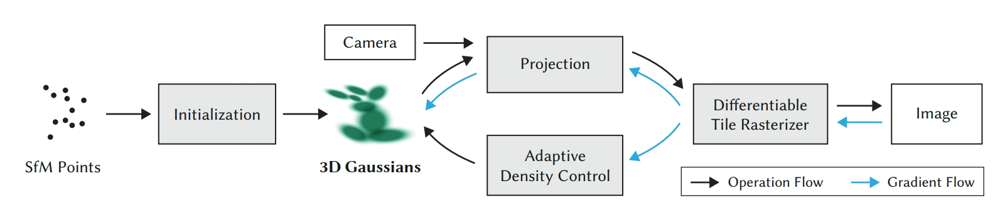
- 三维表征方式对比

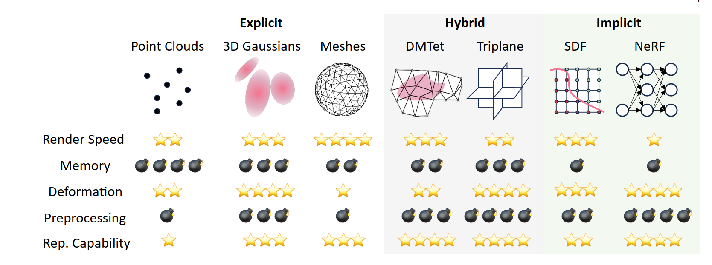

## Text to 3D主要方法

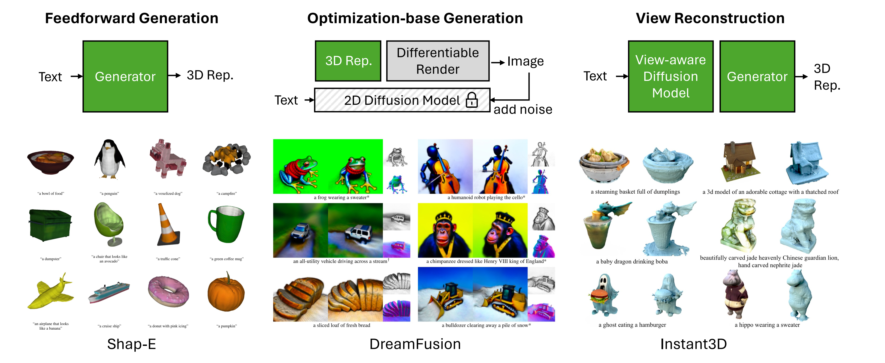

- SDS-based optimization methods：生成时间长（相对），可能存在Janus问题
  - 相关系统：DreamFusion及其使用3DGS改进的版本DreamGaussian、GaussianDreamer等
- feed-forward 3D native methods：生成速度快（5s），但需要提前使用大规模的3D数据集训练
  - 相关系统：LRM，Instant3D, InstantMesh等

## Image to 3D

### Zero 1-to-3

- 2023.3
- 实现了zero-shot的单图片输入生成多视角图片

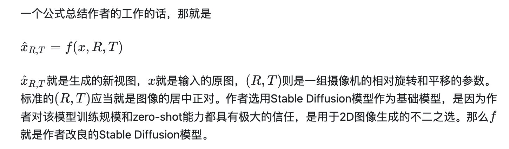

### One-2-3-45

- 2023.6
- 基于Zero 1-to-3 实现三维生成

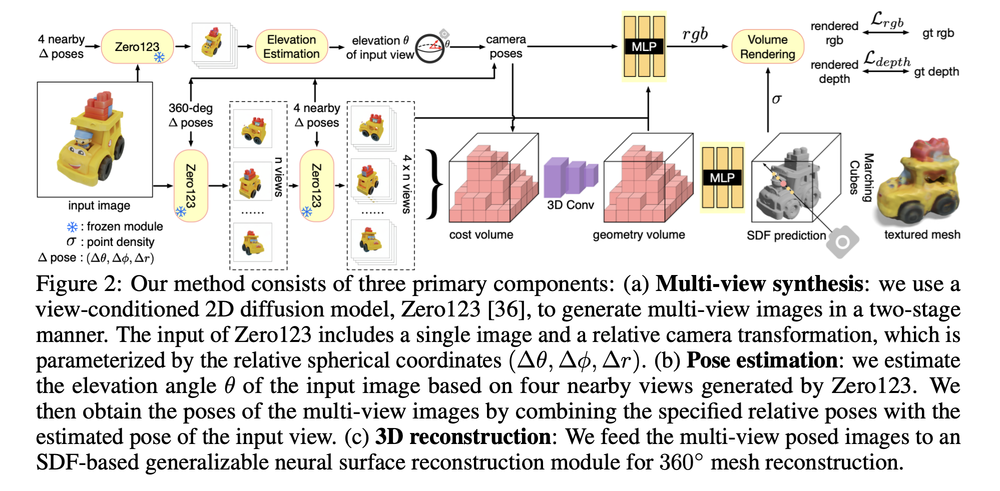

### Wonder3D

- ##### 2023.10
- 同时生成法线图片来辅助3D生成

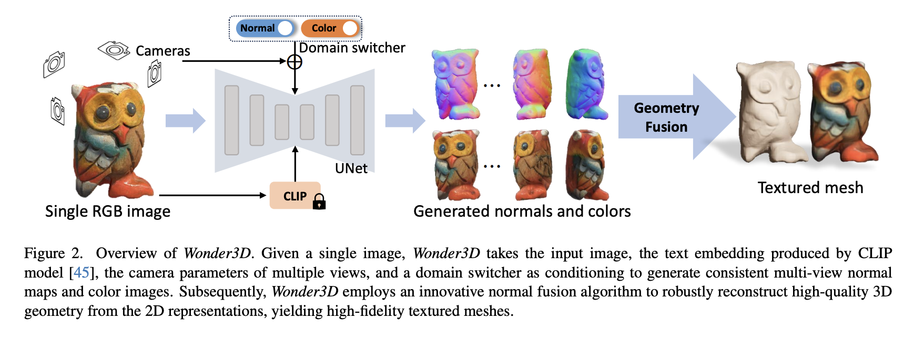

## Optimization相关论文

### DreamGaussian: Generative Gaussian Splatting for Efficient 3D Content Creation

- 2023.9
- text/image to 3d，用时：2min

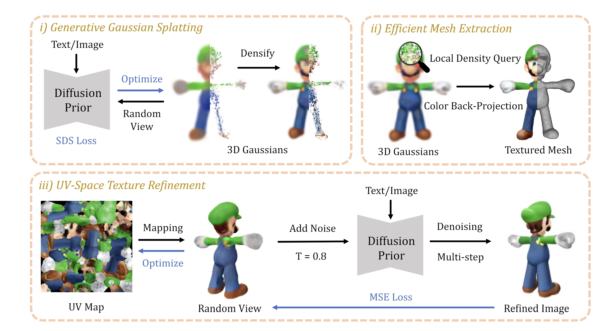

### GaussianDreamer: Fast Generation from Text to 3D Gaussians by Bridging 2D and 3D Diffusion Models

- 2023.10
- 使用Shap-E作为前驱得到一个初步的三维结构，再使用3DGS和2D扩散模型进行优化

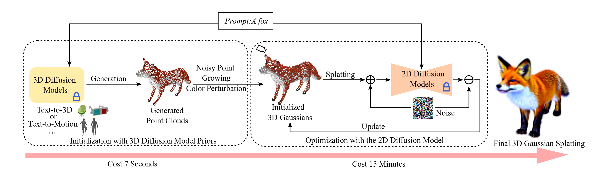

## Feed-forward相关工作

### LRM: Large Reconstruction Model for Single Image to 3D

- 2023.11
- 主要基于transformer结合triplane NeRF
- 5亿参数，100万组数据（annotated 3D）,生成时间5s

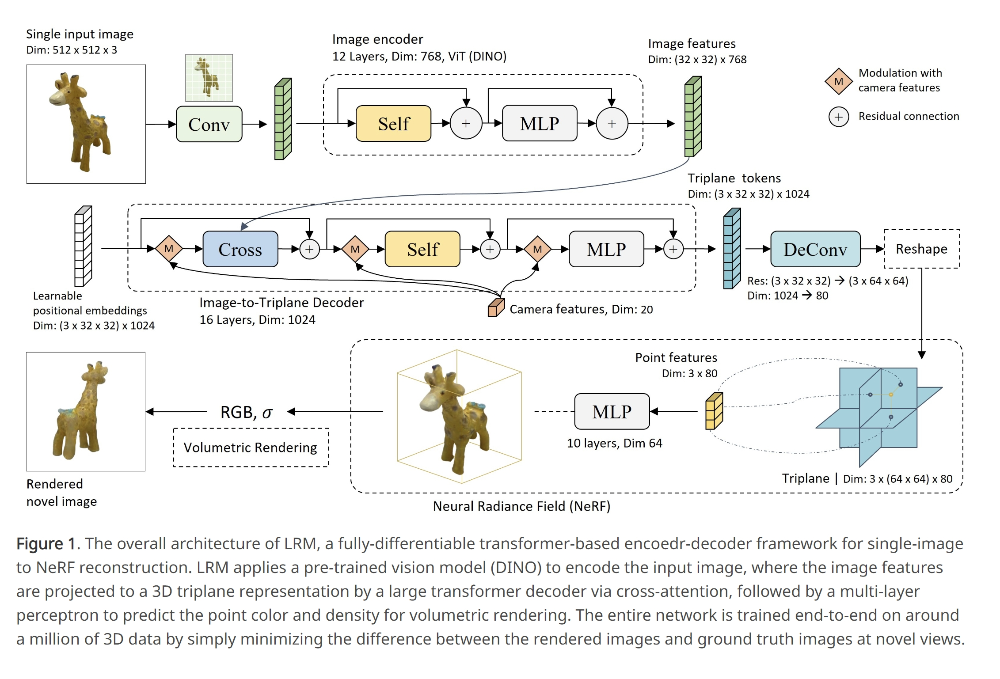

### LGM: Large Multi-View Gaussian Model for High-Resolution 3D Content Creation

  - 2024.2

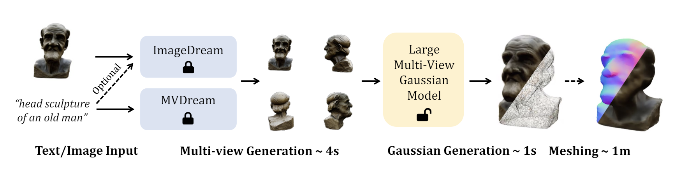

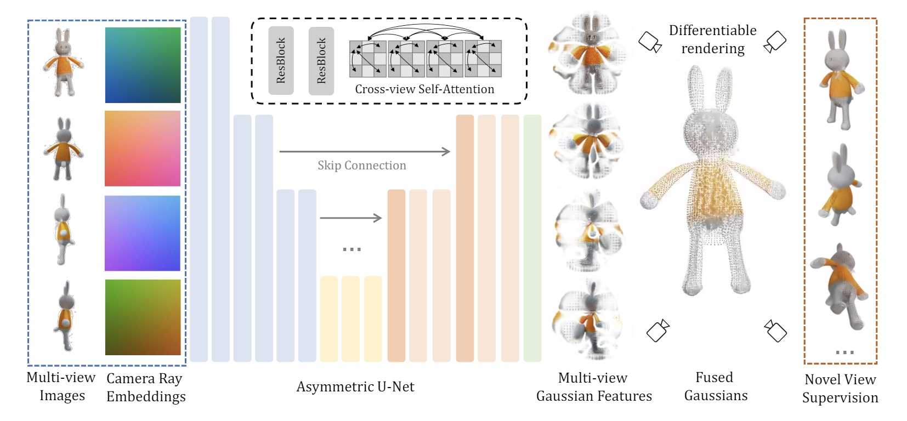

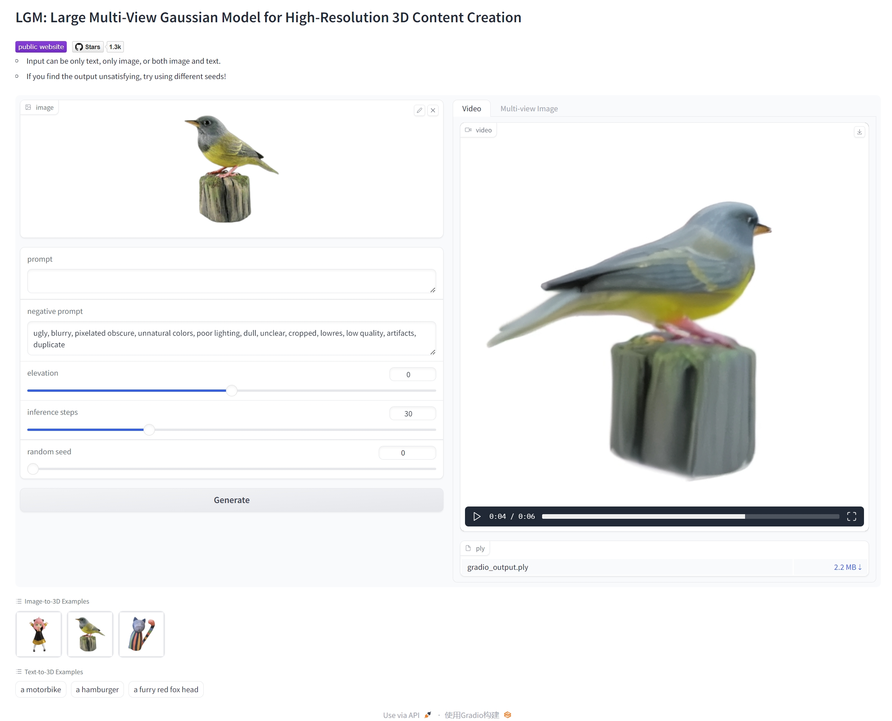

### Instant3D: Fast Text-to-3D with Sparse-View Generation and Large Reconstruction Model（暂无代码）

- 2023.11, 20s text to image
  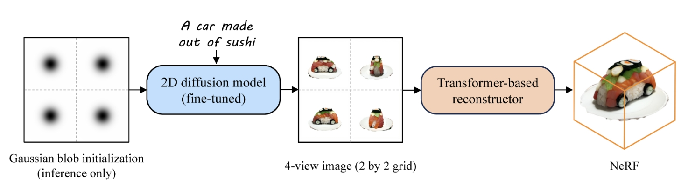

### InstantMesh: Efficient 3D Mesh Generation from a Single Image with Sparse-view Large Reconstruction Models

- 2024.4
- 先使用多视角扩散模型将单视角图片转化为多视角，再通过transformer结构的稀疏视角LRM转换至三维，全过程10s

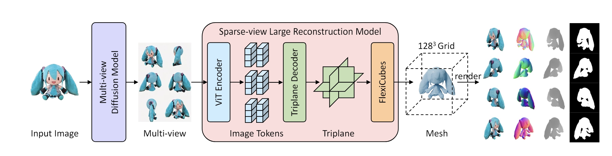

### TripoSR
  - 2024.3，Stablity AI
  - Feed-forward 3D reconstruction from a single image
  - trained for 5 days on 22 GPU nodes each with 8 A100 40GB GPUs

#### GRM: Large Gaussian Reconstruction Model for Efficient 3D Reconstruction and Generation（暂未开源）

## 总结

- 一般使用diffusion模型完成多视角图片生成
- 优化方法需要多轮迭代，使用渲染较快的3DGS替代NeRF可以加快生成速度。大模型使用3DGS和NeRF的都有
- 大模型生成速度快，但训练资源需求非常恐怖。生成质量方面暂时还没有详细对比
- 这半年内相关领域内主要趋势为大模型化，可能与需求10较不相符
